# AttA2C - Attention-based Curiosity-driven Exploration in Deep Reinforcement Learning
#### Author: Patrik Reizinger, MSc student in Electrical Engineering
#### Supervisor and Co-author: Márton Szemenyei, lecturer
#### Organization: Budapest University of Technology and Economics, Department of Control Engineering and Information Technology

Supplementary material for the paper _Attention-based Curiosity-driven Exploration in Deep Reinforcement Learning_ submitted to ICASSP 2020.

## Table of contents
* [General](#general)
* [Proposed methods](#proposed-methods)
* [Results](#results)

## General
The aim of the project is to develop new exploration strategies for Reinforcement Learning for agents which can generalize better. The focus is on curiosity-based methods, such as the Intrinsic Curiosity Module of the paper [Curiosity-driven Exploration by Self-supervised Prediction](https://arxiv.org/abs/1705.05363), which is used extensively to build upon.

This project is implemented in PyTorch, using the [stable-baselines](https://stable-baselines.readthedocs.io/en/master/index.html) package for benchmarking.

## Proposed methods

- __AttA2C (Attention-aided A2C)__: this new version of A2C utilizes attention to split the features fed into the Actor and the Critic.
- __Action- and state-selective ICM__: the extension of ICM aims to use attention for selectively use the features and actions in the forward and inverse dynamic models.
- __Rational Curiosity Module (RCM)__: this novel curiosity formulation aim to incentivize the agent to exploit curiosity only if it contributes to generalization.

## Results
Experiments were carried out on three Atari games: Breakout, Pong and Seaquest (v0 and v4 variants, the former is stochastic, as it uses action repeat with p=0.25).

### Breakout

|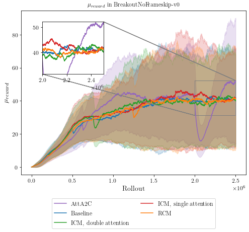|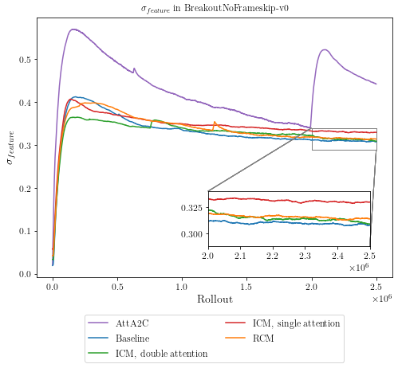|
| - | - |

|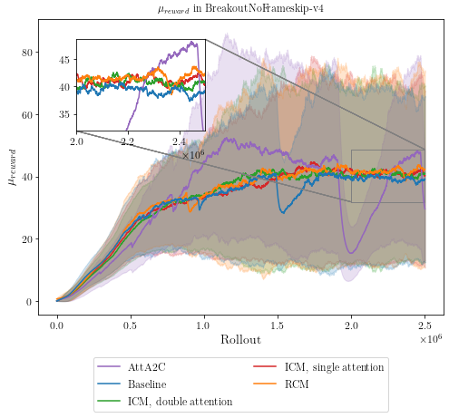|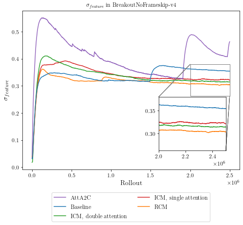|
| - | - |

### Pong

|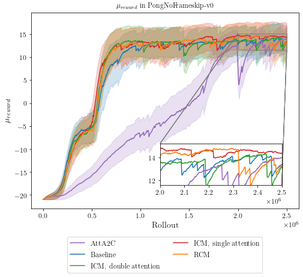|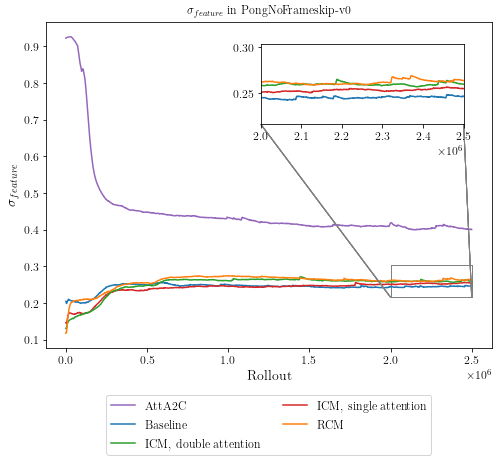|
| - | - |

|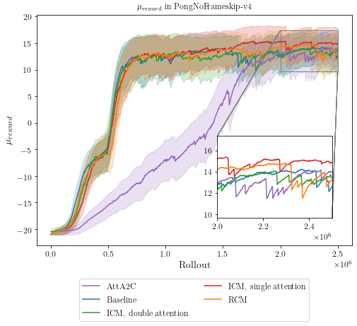|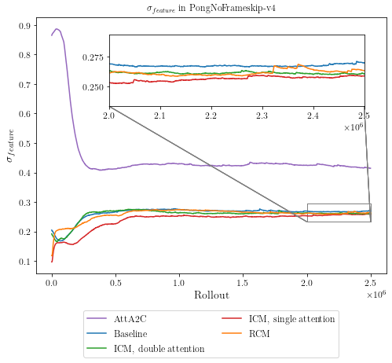|
| - | - |

### Seaquest

|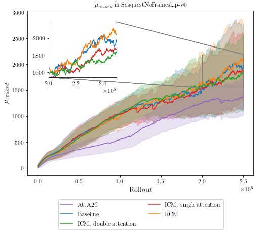|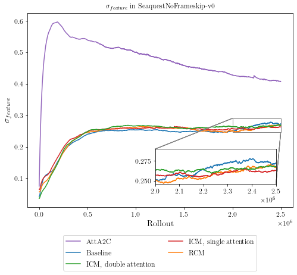|
| - | - |

|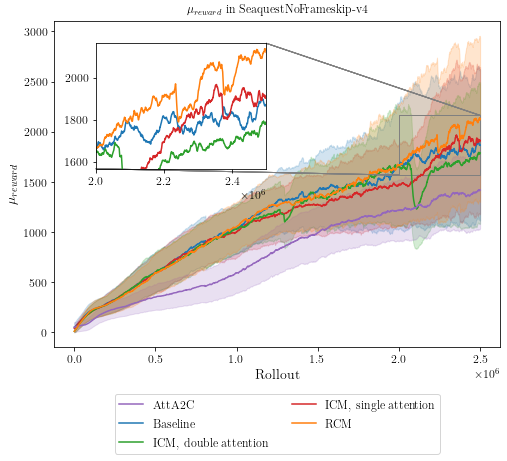|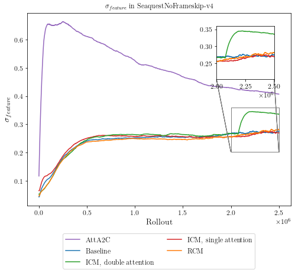|
| - | - |
